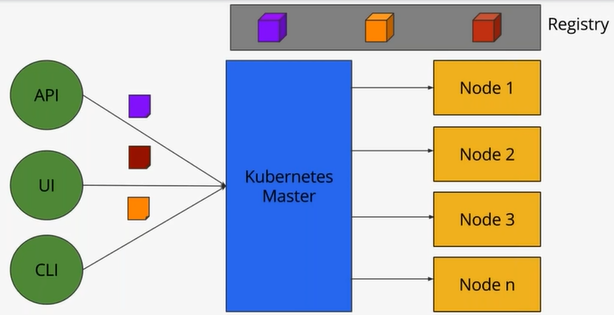
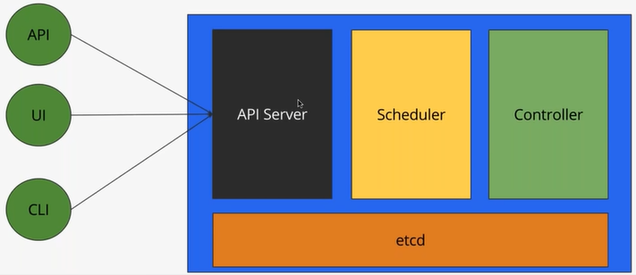
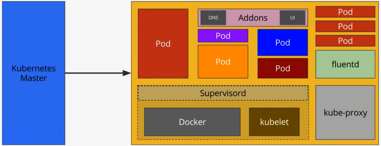
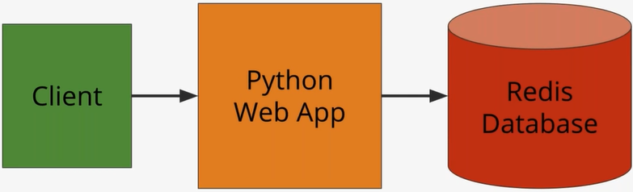
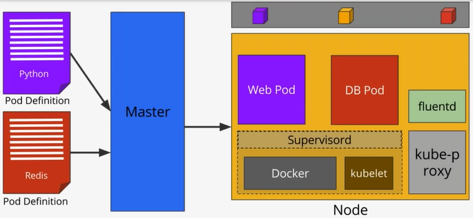
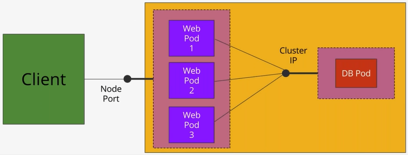

# Kubernetes Architecture

## Objectives
* A closer look at Kubernetes cluster
* Master components
* Nodw components
* Pods
* Labels & Selectors
* Replication Controllers
* Services

---
## Kubernetes Architecture


## Kubernetes Master


### [Kubernetes Design and Architecture](https://github.com/kubernetes/community/blob/master/contributors/design-proposals/architecture/architecture.md#the-kubernetes-node)
* API Server
* Scheduler
* Controller
  * Coordinator, making sure that the pods are running
* etcd
  * Its a key-value databse
## Kubernetes Node

* Pod
* Docker
* kubelet
* kube-proxy
* Supervisord
* fluentd
* Addons (DNS, UI, PetSets)

## A Simple Containerized Application


## Kubernetes Pod
* Group of one or more containers that are always co-located, co-scheduled, and run in a shared context
* Containers in the same pod have the same hostname
* Each pod is isolated by
  * Process ID (PID) namespace
  * Network namespace
  * Interprocess Communication (IPC) namespace
  * Unix Time Sharing (UTS) namespace
* Alternative to a VM with multiple processes

## Labels & Selectors
* Key/value pairs associated with Kubernetes objects
* Used to organize and select subsets of objects
* Attached to objects at creation time but modified at any time.
* Labels are the essential glue to associate one API object with other
	* Relication Controller -> Pods
	* Service -> Pods
	* Pods -> Nodes
## Deploying a Pod


## Services
* An abstraction to define a logical set of Pods bound by a policy to access them
* Services are exposed through internal and external endpoints
* Services can also point to non-Kubernetes endpoints through a Virtual-IP-Bridge
* Supports TCP and UDP
* Interfaces with kube-proxy to manipulate iptables
* Service can be exposed internal or external to the cluster

## Exposing Services


```console
$ kubectl config get-contexts
CURRENT   NAME                    CLUSTER         AUTHINFO             NAMESPACE
*         minikube                minikube        minikube
          mycluster.icp-context   mycluster.icp   mycluster.icp-user   default
$ docker ps
CONTAINER ID        IMAGE                                                  COMMAND
   CREATED             STATUS              PORTS               NAMES
95b8ee8eaf69        nginx                                                  "nginx -g 'daemon ..."
   5 hours ago         Up 4 hours                              k8s_my-web_my-web-84b5767c98-vlmb4_default_85d923f1-dd7e-11e7-ace5-08002720cfab_0
4bc51a5774b4        gcr.io/google_containers/pause-amd64:3.0               "/pause"
   5 hours ago         Up 4 hours                              k8s_POD_my-web-84b5767c98-vlmb4_default_85d923f1-dd7e-11e7-ace5-08002720cfab_0
34dca730a6e4        gcr.io/google_containers/k8s-dns-sidecar-amd64         "/sidecar --v=2 --..."
   9 hours ago         Up 9 hours                              k8s_sidecar_kube-dns-86f6f55dd5-twgwv_kube-system_044ce763-d76b-11e7-bd99-08002720cfab_7
c1a8ebdb8599        gcr.io/google_containers/k8s-dns-dnsmasq-nanny-amd64   "/dnsmasq-nanny -v..."
   9 hours ago         Up 9 hours                              k8s_dnsmasq_kube-dns-86f6f55dd5-twgwv_kube-system_044ce763-d76b-11e7-bd99-08002720cfab_7
7e396db1bab6        gcr.io/kubernetes-helm/tiller                          "/tiller"
   9 hours ago         Up 9 hours                              k8s_tiller_tiller-deploy-7cb6884b74-w2pqw_kube-system_1c30ffb5-d9ba-11e7-9ad0-08002720cfab_3
f54298206cfd        gcr.io/google_containers/kubernetes-dashboard-amd64    "/dashboard --inse..."
   9 hours ago         Up 9 hours                              k8s_kubernetes-dashboard_kubernetes-dashboard-klx49_kube-system_04316921-d76b-11e7-bd99-08002720cfab_8
def26e1204cf        gcr.io/google_containers/k8s-dns-kube-dns-amd64        "/kube-dns --domai..."
   9 hours ago         Up 9 hours                              k8s_kubedns_kube-dns-86f6f55dd5-twgwv_kube-system_044ce763-d76b-11e7-bd99-08002720cfab_7
1737981b8f9b        grafana/grafana                                        "/run.sh"
   9 hours ago         Up 9 hours                              k8s_grafana_grafana-6c9655ff8c-2gcbj_monitoring_a329f6ff-d9b1-11e7-9ad0-08002720cfab_3
3ca5cc9f90ca        gcr.io/k8s-minikube/storage-provisioner                "/storage-provisioner"
   9 hours ago         Up 9 hours                              k8s_storage-provisioner_storage-provisioner_kube-system_03dd8fc9-d76b-11e7-bd99-08002720cfab_7
a729e69e1770        quay.io/prometheus/prometheus                          "/bin/prometheus -..."
   9 hours ago         Up 9 hours                              k8s_prometheus_prometheus-7bb476b94c-wslx2_monitoring_2afe2e0a-d9b0-11e7-9ad0-08002720cfab_3
fc52189b160e        gcr.io/google_containers/pause-amd64:3.0               "/pause"
   9 hours ago         Up 9 hours                              k8s_POD_tiller-deploy-7cb6884b74-w2pqw_kube-system_1c30ffb5-d9ba-11e7-9ad0-08002720cfab_3
7a1721744d42        gcr.io/google_containers/pause-amd64:3.0               "/pause"
   9 hours ago         Up 9 hours                              k8s_POD_kubernetes-dashboard-klx49_kube-system_04316921-d76b-11e7-bd99-08002720cfab_7
771b6d3ca8ac        gcr.io/google_containers/pause-amd64:3.0               "/pause"
   9 hours ago         Up 9 hours                              k8s_POD_storage-provisioner_kube-system_03dd8fc9-d76b-11e7-bd99-08002720cfab_7
2246c44ff557        gcr.io/google_containers/pause-amd64:3.0               "/pause"
   9 hours ago         Up 9 hours                              k8s_POD_grafana-6c9655ff8c-2gcbj_monitoring_a329f6ff-d9b1-11e7-9ad0-08002720cfab_3
e932a94d49a2        gcr.io/google_containers/pause-amd64:3.0               "/pause"
   9 hours ago         Up 9 hours                              k8s_POD_kube-dns-86f6f55dd5-twgwv_kube-system_044ce763-d76b-11e7-bd99-08002720cfab_7
57c3b5f3170d        gcr.io/google_containers/pause-amd64:3.0               "/pause"
   9 hours ago         Up 9 hours                              k8s_POD_prometheus-7bb476b94c-wslx2_monitoring_2afe2e0a-d9b0-11e7-9ad0-08002720cfab_3
9935e8ea659e        gcr.io/google-containers/kube-addon-manager            "/opt/kube-addons.sh"
   9 hours ago         Up 9 hours                              k8s_kube-addon-manager_kube-addon-manager-minikube_kube-system_7b19c3ba446df5355649563d32723e4f_7
348d1a35a2d3        gcr.io/google_containers/pause-amd64:3.0               "/pause"
   9 hours ago         Up 9 hours                              k8s_POD_kube-addon-manager-minikube_kube-system_7b19c3ba446df5355649563d32723e4f_7
$ kubectl cluster-info
Kubernetes master is running at https://192.168.99.100:8443

To further debug and diagnose cluster problems, use 'kubectl cluster-info dump'.
$ kubectl get cs
NAME                 STATUS    MESSAGE              ERROR
scheduler            Healthy   ok
controller-manager   Healthy   ok
etcd-0               Healthy   {"health": "true"}
```	

Let's look at a new demo, before doing so, let's make sure that we have a clean environment with the necesary files for the demo.
```console
$ kubectl get pod
NAME                      READY     STATUS    RESTARTS   AGE
my-web-84b5767c98-vlmb4   1/1       Running   0          5h
$ kubectl delete pod my-web
pod "my-web" deleted
$ kubectl delete svc my-web
service "my-web" deleted
$ kubectl get pod
No resources found.
$ kubectl get rc
No resources found.
$ kubectl get svc
NAME         TYPE        CLUSTER-IP   EXTERNAL-IP   PORT(S)   AGE
kubernetes   ClusterIP   10.96.0.1    <none>        443/TCP   7d
$ ls
Dockerfile  db-pod.yaml  demo.sh              images/                      web-pod.yaml
app.py      db-svc.yaml  docker-compose.yaml  kubernetes_architecture.md
```
Now that we have a clean environment we can begin with the demo...

```console
$ kubectl create -f db-pod.yaml
pod "redis" created
$ kubectl get pod
NAME      READY     STATUS    RESTARTS   AGE
redis     1/1       Running   0          51s
$ kubectl create -f db-svc.yaml
service "redis" created
$ kubectl get svc
NAME         TYPE        CLUSTER-IP      EXTERNAL-IP   PORT(S)    AGE
kubernetes   ClusterIP   10.96.0.1       <none>        443/TCP    7d
redis        ClusterIP   10.111.14.203   <none>        6379/TCP   1m
$ kubectl create -f web-pod.yaml
pod "web" created
$ kubectl get pods
NAME      READY     STATUS              RESTARTS   AGE
redis     1/1       Running             0          6m
web       0/1       ContainerCreating   0          41s
$ kubectl get pods
NAME      READY     STATUS    RESTARTS   AGE
redis     1/1       Running   0          7m
web       1/1       Running   0          2m
$ kubectl exec -it web /bin/bash
root@web:/usr/src/app# ls
app.py  build.sh  flask  requirements.txt
root@web:/usr/src/app# cat app.py
from flask import Flask
from redis import Redis
import os
app = Flask(__name__)
redis = Redis(host=os.environ.get('REDIS_HOST', 'redis'), port=6379)

@app.route('/')
def hello():
    redis.incr('hits')
    return 'Hello Container World! I have been seen %s times.\n' % redis.get('hits')

if __name__ == "__main__":
    app.run(host="0.0.0.0", port=5000, debug=True)root@web:/usr/src/app# env
REDIS_PORT_6379_TCP_PROTO=tcp
HOSTNAME=web
GPG_KEY=C01E1CAD5EA2C4F0B8E3571504C367C218ADD4FF
REDIS_SERVICE_PORT_REDIS=6379
KUBERNETES_PORT_443_TCP_PORT=443
KUBERNETES_PORT=tcp://10.96.0.1:443
REDIS_SERVICE_PORT=6379
KUBERNETES_SERVICE_PORT=443
KUBERNETES_SERVICE_HOST=10.96.0.1
REDIS_PORT_6379_TCP_ADDR=10.111.14.203
REDIS_PORT_6379_TCP_PORT=6379
PYTHON_VERSION=2.7.12
PATH=/usr/local/bin:/usr/local/sbin:/usr/local/bin:/usr/sbin:/usr/bin:/sbin:/bin
PWD=/usr/src/app
LANG=C.UTF-8
REDIS_PORT_6379_TCP=tcp://10.111.14.203:6379
PYTHON_PIP_VERSION=8.1.2
SHLVL=1
HOME=/root
REDIS_PORT=tcp://10.111.14.203:6379
KUBERNETES_PORT_443_TCP_PROTO=tcp
KUBERNETES_SERVICE_PORT_HTTPS=443
REDIS_SERVICE_HOST=10.111.14.203
KUBERNETES_PORT_443_TCP_ADDR=10.96.0.1
KUBERNETES_PORT_443_TCP=tcp://10.96.0.1:443
_=/usr/bin/env
root@web:/usr/src/app# ping redis
PING redis.default.svc.cluster.local (10.111.14.203): 56 data bytes
^C--- redis.default.svc.cluster.local ping statistics ---
40 packets transmitted, 0 packets received, 100% packet loss
root@web:/usr/src/app# curl localhost:5000
Hello Container World! I have been seen 1 times.
root@web:/usr/src/app# exit
exit
$
``` 

We have exited the container and back to our Kubernetes program...

```console
λ kubectl describe pod web
Name:         web
Namespace:    default
Node:         minikube/192.168.99.100
Start Time:   Sun, 10 Dec 2017 21:23:53 +0800
Labels:       app=demo
              name=web
Annotations:  <none>
Status:       Running
IP:           172.17.0.8
Containers:
  web:
    Container ID:   docker://63074cbd2d04bc7f021681a4ac661c027b44372cdae54d0491813bad7829074f
    Image:          janakiramm/web
    Image ID:       docker-pullable://janakiramm/web@sha256:6e913c17fb1d6f230655abd7db47e55c0bf274c4074d410fdd2cad183c2ab49e
    Port:           5000/TCP
    State:          Running
      Started:      Sun, 10 Dec 2017 21:25:33 +0800
    Ready:          True
    Restart Count:  0
    Environment:    <none>
    Mounts:
      /var/run/secrets/kubernetes.io/serviceaccount from default-token-zk79b (ro)
Conditions:
  Type           Status
  Initialized    True
  Ready          True
  PodScheduled   True
Volumes:
  default-token-zk79b:
    Type:        Secret (a volume populated by a Secret)
    SecretName:  default-token-zk79b
    Optional:    false
QoS Class:       BestEffort
Node-Selectors:  <none>
Tolerations:     <none>
Events:
  Type    Reason                 Age   From               Message
  ----    ------                 ----  ----               -------
  Normal  Scheduled              41m   default-scheduler  Successfully assigned web to minikube
  Normal  SuccessfulMountVolume  41m   kubelet, minikube  MountVolume.SetUp succeeded for volume "default-token-zk79b"
  Normal  Pulling                41m   kubelet, minikube  pulling image "janakiramm/web"
  Normal  Pulled                 40m   kubelet, minikube  Successfully pulled image "janakiramm/web"
  Normal  Created                40m   kubelet, minikube  Created container
  Normal  Started                39m   kubelet, minikube  Started container
```

## Replication Controller
* Ensures that a Pod or homogeneous set of Pods are always up and available
* Always maintains desired number of Pods
	* If there are excess Pods, they get killed
	* New pods are launched when they fail, get deleted, or terminated
* Creating a replication controller with a count of 1 ensures that a Pod is always available
* Replication controller and Pods are associated through Labels

## Scaling Pods with Replication Controller


## Demo
### Scaling Pods with Replication Controller

```console
$ kubectl create -f web-rc.yaml
replicationcontroller "web" created
$ kubectl get rc
NAME      DESIRED   CURRENT   READY     AGE
web       2         2         2         35s
$ kubectl get po
NAME        READY     STATUS    RESTARTS   AGE
redis       1/1       Running   0          1h
web         1/1       Running   0          1h
web-vtxdz   1/1       Running   0          1m
$ kubectl delete pod web-vtxdz
pod "web-vtxdz" deleted
$ kubectl get po
NAME        READY     STATUS    RESTARTS   AGE
redis       1/1       Running   0          1h
web         1/1       Running   0          1h
web-zdmcg   1/1       Running   0          29s
$ kubectl scale rc web --replicas=10
replicationcontroller "web" scaled
$ kubectl get po
NAME        READY     STATUS              RESTARTS   AGE
redis       1/1       Running             0          1h
web         1/1       Running             0          1h
web-2q2nh   0/1       ContainerCreating   0          23s
web-8tfzt   1/1       Running             0          23s
web-cckb9   0/1       ContainerCreating   0          23s
web-l2sz6   1/1       Running             0          23s
web-l8vq4   0/1       ContainerCreating   0          23s
web-rbj92   1/1       Running             0          23s
web-v42qq   0/1       ContainerCreating   0          23s
web-xgpqq   1/1       Running             0          23s
web-zdmcg   1/1       Running             0          3m
$ kubectl get po
NAME        READY     STATUS    RESTARTS   AGE
redis       1/1       Running   0          1h
web         1/1       Running   0          1h
web-2q2nh   1/1       Running   0          1m
web-8tfzt   1/1       Running   0          1m
web-cckb9   1/1       Running   0          1m
web-l2sz6   1/1       Running   0          1m
web-l8vq4   1/1       Running   0          1m
web-rbj92   1/1       Running   0          1m
web-v42qq   1/1       Running   0          1m
web-xgpqq   1/1       Running   0          1m
web-zdmcg   1/1       Running   0          4m
$ kubectl get nodes
NAME       STATUS    ROLES     AGE       VERSION
minikube   Ready     <none>    8d        v1.8.0
```

## Summary
* Kubernetes Master runs the API, Scheduler and Controller services
* Each Node is responsible for running one or more Pods
* Pods are the unit of deployment in Kubernetes
* Labels associate one Kubernetes object with the other
* Replication Controller ensures high availability of Pods
* Services expose Pods to internal and external consumers

Reference:
* [Kubernetes Webinar Series - Kubernetes Architecture 101](https://www.youtube.com/watch?v=zeS6OyDoy78&index=2&list=PLF3s2WICJlqOiymMaTLjwwHz-MSVbtJPQ)

