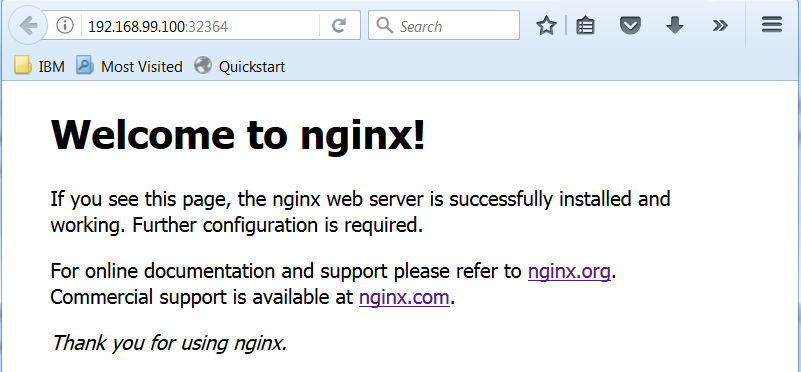
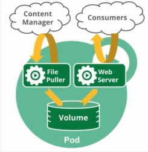
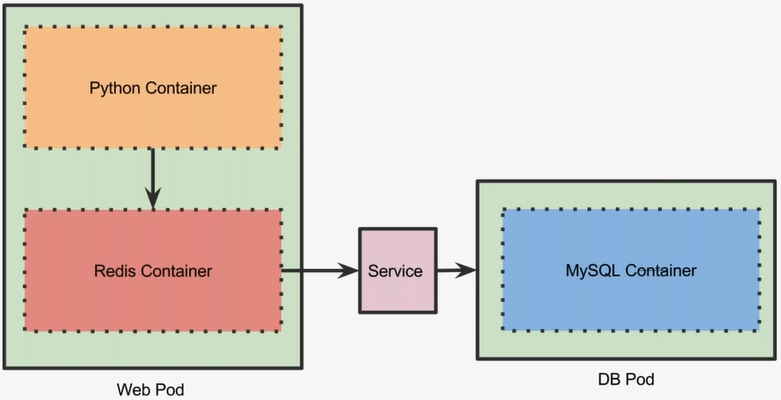

# Kubernetes Webinar Series - A Closer Look at Pods and Replicas

## Objectives

* Understand the concept of Pods
* Explore multi-container Pods
* Closer look at the use cases and scenarios for multi-container pods
* Scalling Pods through Replica Sets

---
## What is Pod?

* A group one or more containers that are always co-located and co-scheduled that share the context
* Containers in a pod share the same IP address, ports, hostname and storage
* Modeled like a virtual machine:
	* Each container represents one process
	* Tightly coupled with other containers in the same pod
* Pods are scheduled in Nodes
* Fundamental unit of deployment in Kubernetes

## Demo
### Creating First Pod
```console
$ kubectl config get-contexts
CURRENT   NAME                    CLUSTER         AUTHINFO             NAMESPACE
          mycluster.icp-context   mycluster.icp   mycluster.icp-user   default
*         minikube                minikube        minikube
$ kubectl get cs
NAME                 STATUS    MESSAGE              ERROR
controller-manager   Healthy   ok
scheduler            Healthy   ok
etcd-0               Healthy   {"health": "true"}
$ kubectl get nodes
NAME       STATUS    ROLES     AGE       VERSION
minikube   Ready     <none>    8d        v1.8.0
$ kubectl get po
No resources found.
$ kubectl create -f mypod.yaml
pod "mypod" created
$ kubectl get po
NAME      READY     STATUS              RESTARTS   AGE
mypod     0/1       ContainerCreating   0          0s
$ kubectl get po
NAME      READY     STATUS    RESTARTS   AGE
mypod     1/1       Running   0          37s
$ kubectl describe pod mypod
Name:         mypod
Namespace:    default
Node:         minikube/192.168.99.100
Start Time:   Mon, 11 Dec 2017 08:30:34 +0800
Labels:       app=demo
              env=test
Annotations:  <none>
Status:       Running
IP:           172.17.0.3
Containers:
  nginx:
    Container ID:   docker://1f16bf664b53913c74f6444378e08737ff5763a5987d5a61894dd8eeafd7f707
    Image:          nginx
    Image ID:       docker-pullable://nginx@sha256:b81f317384d7388708a498555c28a7cce778a8f291d90021208b3eba3fe74887
    Port:           80/TCP
    State:          Running
      Started:      Mon, 11 Dec 2017 08:30:46 +0800
    Ready:          True
    Restart Count:  0
    Environment:    <none>
    Mounts:
      /var/run/secrets/kubernetes.io/serviceaccount from default-token-zk79b (ro)
Conditions:
  Type           Status
  Initialized    True
  Ready          True
  PodScheduled   True
Volumes:
  default-token-zk79b:
    Type:        Secret (a volume populated by a Secret)
    SecretName:  default-token-zk79b
    Optional:    false
QoS Class:       BestEffort
Node-Selectors:  <none>
Tolerations:     <none>
Events:
  Type    Reason                 Age   From               Message
  ----    ------                 ----  ----               -------
  Normal  Scheduled              1m    default-scheduler  Successfully assigned mypod to minikube

  Normal  SuccessfulMountVolume  1m    kubelet, minikube  MountVolume.SetUp succeeded for volume "default-token-zk79b"
  Normal  Pulling                1m    kubelet, minikube  pulling image "nginx"
  Normal  Pulled                 1m    kubelet, minikube  Successfully pulled image "nginx"
  Normal  Created                1m    kubelet, minikube  Created container
  Normal  Started                1m    kubelet, minikube  Started container
```
At a later stage we will go through the details of creating a service similar to the way we built a pod via a declarative file, but for the time being we will simply create a service from the command line using `kubectl expose pod`, the right syntax will be shown below:

```console
$ kubectl expose pod mypod --type=NodePort
service "mypod" exposed
```

We can see that the pod was created with a tag `--type=NodePort` this indicates that we can access the pod from external to the pod, we will elaborate on this later.

```console
$ kubectl get svc
NAME         TYPE        CLUSTER-IP      EXTERNAL-IP   PORT(S)        AGE
kubernetes   ClusterIP   10.96.0.1       <none>        443/TCP        8d
mypod        NodePort    10.111.38.217   <none>        80:32364/TCP   29s
```
Look closely at the second line, you see this under PORT(S) **80:32364/TCP** this indicates that we can access the service at port **32364**.
There a quick way to access this from minikube by simply typing:
```console
$ minikube service mypod
Opening kubernetes service default/mypod in default browser...
```
A browser would have opened with the service... in my case.



Say in the case that I'm not using minikube, I can access the service via the `describe` command, as shown below:
```console
$ kubectl describe svc mypod
Name:                     mypod
Namespace:                default
Labels:                   app=demo
                          env=test
Annotations:              <none>
Selector:                 app=demo,env=test
Type:                     NodePort
IP:                       10.111.38.217
Port:                     <unset>  80/TCP
TargetPort:               80/TCP
NodePort:                 <unset>  32364/TCP
Endpoints:                172.17.0.3:80
Session Affinity:         None
External Traffic Policy:  Cluster
Events:                   <none>
```
It's the same port as shown before, _NodePort:                 <unset>  32364/TCP_
Now, I can access the site by issuing these commands:
```console
$ minikube ip
192.168.99.100
$ curl 192.168.99.100:32364
<!DOCTYPE html>
<html>
<head>
<title>Welcome to nginx!</title>
<style>
    body {
        width: 35em;
        margin: 0 auto;
        font-family: Tahoma, Verdana, Arial, sans-serif;
    }
</style>
</head>
<body>
<h1>Welcome to nginx!</h1>
<p>If you see this page, the nginx web server is successfully installed and
working. Further configuration is required.</p>

<p>For online documentation and support please refer to
<a href="http://nginx.org/">nginx.org</a>.<br/>
Commercial support is available at
<a href="http://nginx.com/">nginx.com</a>.</p>

<p><em>Thank you for using nginx.</em></p>
</body>
</html>
```
## What is a Pod?
{:height="245px" width="252px"}
A multi-container pod that contains a file puller and a web server that uses a persistent volume for a shared storage between the containers.
* Containers within the same pod communicate with each other using IPC 'Inter Process Communication'
* Containers can find each other via _localhost_
* Each container inherits the name of the pod
* Each pod has an IP address in a flat shared networking space
* Volumes are shared by containers in a pod

## Use Cases for Pod
* Content management systems, file and data loaders, local cache managers, etc.
* Log and checkpoint backup, compression, rotation, snapshotting, etc.
* Data change watchers, log tailers, logging and monitoring adapters, event publishers, etc.
* Proxies, bridges and adapters
* Controllers, managers, configurators, and updaters
## Multi-Container Pod with Python and Redis

## Demo
### Exploring a Multi-Container Pod
```console
$ kubectl create -f db-pod.yaml
pod "mysql" created
$ kubectl create -f db-svc.yaml
service "mysql" created
$ kubectl create -f web-pod-1.yaml
pod "web1" created
$ kubectl create -f web-svc.yaml
service "web" created
$ kubectl describe svc web
Name:                     web
Namespace:                default
Labels:                   app=demo
                          name=web
Annotations:              <none>
Selector:                 name=web
Type:                     NodePort
IP:                       10.109.0.27
Port:                     http  80/TCP
TargetPort:               5000/TCP
NodePort:                 http  31282/TCP
Endpoints:                172.17.0.8:5000
Session Affinity:         None
External Traffic Policy:  Cluster
Events:                   <none>
$ kubectl get po
NAME      READY     STATUS    RESTARTS   AGE
mypod     1/1       Running   0          2h
mysql     1/1       Running   0          14m
web1      2/2       Running   0          3m
```
Let's delete the mypod pod and svc, there are no longer needed:
```console
$ kubectl delete pod mypod
pod "mypod" deleted
$ kubectl get po
NAME      READY     STATUS    RESTARTS   AGE
mysql     1/1       Running   0          18m
web1      2/2       Running   0          7m
$ kubectl delete svc mypod
service "mypod" deleted
$ kubectl get svc
NAME         TYPE        CLUSTER-IP     EXTERNAL-IP   PORT(S)        AGE
kubernetes   ClusterIP   10.96.0.1      <none>        443/TCP        8d
mysql        ClusterIP   10.98.129.95   <none>        3306/TCP       13m
web          NodePort    10.109.0.27    <none>        80:31282/TCP   7m
```
Now, we can look at our newly created pods by issuing the `describe` command:
```console
λ kubectl describe po
Name:         mysql
Namespace:    default
Node:         minikube/192.168.99.100
Start Time:   Mon, 11 Dec 2017 10:18:11 +0800
Labels:       app=demo
              name=mysql
Annotations:  <none>
Status:       Running
IP:           172.17.0.7
Containers:
  mysql:
    Container ID:   docker://cbdc2a59d9def1727fbbfbe068bc44e4d78178b4531847f21eca6d2de0dc4fb7
    Image:          mysql:latest
    Image ID:       docker-pullable://mysql@sha256:ed6e70fcd9126d7b246d2beb512aa7cb0aafac4bfda11ee9d8a4f5c488c437f9
    Port:           3306/TCP
    State:          Running
      Started:      Mon, 11 Dec 2017 10:18:47 +0800
    Ready:          True
    Restart Count:  0
    Environment:
      MYSQL_ROOT_PASSWORD:  password
    Mounts:
      /var/run/secrets/kubernetes.io/serviceaccount from default-token-zk79b (ro)
Conditions:
  Type           Status
  Initialized    True
  Ready          True
  PodScheduled   True
Volumes:
  default-token-zk79b:
    Type:        Secret (a volume populated by a Secret)
    SecretName:  default-token-zk79b
    Optional:    false
QoS Class:       BestEffort
Node-Selectors:  <none>
Tolerations:     <none>
Events:
  Type    Reason                 Age   From               Message
  ----    ------                 ----  ----               -------
  Normal  Scheduled              21m   default-scheduler  Successfully assigned mysql to minikube

  Normal  SuccessfulMountVolume  21m   kubelet, minikube  MountVolume.SetUp succeeded for volume "default-token-zk79b"
  Normal  Pulling                21m   kubelet, minikube  pulling image "mysql:latest"
  Normal  Pulled                 21m   kubelet, minikube  Successfully pulled image "mysql:latest"
  Normal  Created                21m   kubelet, minikube  Created container
  Normal  Started                21m   kubelet, minikube  Started container


Name:         web1
Namespace:    default
Node:         minikube/192.168.99.100
Start Time:   Mon, 11 Dec 2017 10:29:13 +0800
Labels:       app=demo
              name=web
Annotations:  <none>
Status:       Running
IP:           172.17.0.8
Containers:
  redis:
    Container ID:   docker://c4f245654d7d5362a7a91da840cb4e13183cf740d01bde5f9740e08e4a788e3a
    Image:          redis
    Image ID:       docker-pullable://redis@sha256:de4e675f62e4f3f71f43e98ae46a67dba92459ff950de4428d13289b69328f96
    Port:           6379/TCP
    State:          Running
      Started:      Mon, 11 Dec 2017 10:29:20 +0800
    Ready:          True
    Restart Count:  0
    Environment:    <none>
    Mounts:
      /var/run/secrets/kubernetes.io/serviceaccount from default-token-zk79b (ro)
  python:
    Container ID:   docker://fbd8ee67a7e6440b960585e91415bf0ce4ed9cced9928864b502baaa4a77407c
    Image:          janakiramm/py-red
    Image ID:       docker-pullable://janakiramm/py-red@sha256:54961a3b9d64322fd0b0e6312d10075f97b2b4911509aa1f61a54b7d7b9d26d5
    Port:           5000/TCP
    State:          Running
      Started:      Mon, 11 Dec 2017 10:29:33 +0800
    Ready:          True
    Restart Count:  0
    Environment:
      REDIS_HOST:  localhost
    Mounts:
      /var/run/secrets/kubernetes.io/serviceaccount from default-token-zk79b (ro)
Conditions:
  Type           Status
  Initialized    True
  Ready          True
  PodScheduled   True
Volumes:
  default-token-zk79b:
    Type:        Secret (a volume populated by a Secret)
    SecretName:  default-token-zk79b
    Optional:    false
QoS Class:       BestEffort
Node-Selectors:  <none>
Tolerations:     <none>
Events:
  Type    Reason                 Age   From               Message
  ----    ------                 ----  ----               -------
  Normal  Scheduled              10m   default-scheduler  Successfully assigned web1 to minikube
  Normal  SuccessfulMountVolume  10m   kubelet, minikube  MountVolume.SetUp succeeded for volume "default-token-zk79b"
  Normal  Pulling                10m   kubelet, minikube  pulling image "redis"
  Normal  Pulled                 10m   kubelet, minikube  Successfully pulled image "redis"
  Normal  Created                10m   kubelet, minikube  Created container
  Normal  Started                10m   kubelet, minikube  Started container
  Normal  Pulling                10m   kubelet, minikube  pulling image "janakiramm/py-red"
  Normal  Pulled                 10m   kubelet, minikube  Successfully pulled image "janakiramm/py-red"
  Normal  Created                10m   kubelet, minikube  Created container
  Normal  Started                10m   kubelet, minikube  Started container

```

checkpoint 40' into the video
## Replication Controller
* Ensures that a Pod or homogeneous set of Pods are always up and available
* Always maintains desired number of Pods
	* If there are excess Pods, they get killed
	* New pods are launched when they fail, get deleted, or terminated
* Creating a replication controller with a count of 1 ensures that a Pod is always available
* Replication Controller and Pods are associated through Labels
## Replica Set
* Replica Sets are the next generation Replication Controllers
* Ensures specified number of pods are always running
* Pods are replaced by Replica Sets when a failure occurs
	* New pods automatically scheduled
* Labels and Selectors are used for associating Pods with Replica Sets
* Usually combined with Pods when defining the deployment
## Demo
### Scalling Replica Sets
```console
$ kubectl get po
NAME      READY     STATUS    RESTARTS   AGE
mysql     1/1       Running   0          1h
web1      2/2       Running   0          1h
web2      2/2       Running   0          1m
$ kubectl delete po web2
pod "web2" deleted
$ kubectl get po
NAME      READY     STATUS    RESTARTS   AGE
mysql     1/1       Running   0          1h
web1      2/2       Running   0          1h
$ kubectl create -f web-rc.yaml
replicationcontroller "web" created
$ kubectl get po
NAME        READY     STATUS              RESTARTS   AGE
mysql       1/1       Running             0          1h
web-5cds7   0/2       ContainerCreating   0          39s
web-7scl5   0/2       ContainerCreating   0          39s
web1        2/2       Running             0          1h
$ kubectl get po
NAME        READY     STATUS    RESTARTS   AGE
mysql       1/1       Running   0          1h
web-5cds7   2/2       Running   0          1m
web-7scl5   2/2       Running   0          1m
web1        2/2       Running   0          1h
```

You would have noticed that 2 new pods were created with arbitrary name attached to web, it's simply because the replicationcontroller file had stated 3 replicas. Mind you the replicationcontroller has spawn 2 pods, given that web1 already existed, now, how did it know that web1 was part of the replicationcontroller, this is due to the labels and selectors; it matches the same metadata under the labels in the web-rc.yaml file.

Let's try to delete one of the pods and see what happens, previously when we simply killed the pod it just got deleted, now this is different, as the pods are associated with the replicationcontroller and replicationcontroller has a desired number and that number must be maintained at all time.

```console
$ kubectl delete pod web-5cds7
pod "web-5cds7" deleted
$ kubectl get po
NAME        READY     STATUS              RESTARTS   AGE
mysql       1/1       Running             0          2h
web-5cds7   0/2       Terminating         0          17m
web-djv98   0/2       ContainerCreating   0          4s
web1        2/2       Running             0          1h
```

While pod web-5cds7 is getting deleted at the same time a new pod web-djv98 is being generated in making sure that the total pod available remains at 10, as 10 is the desired number of pods that was declared in the web-rc.yaml file.

We can also use the command line to scale the pod via replicationcontroller, as shown below.

```console
$ kubectl scale rc web --replicas=4
replicationcontroller "web" scaled
$ kubectl get po
NAME        READY     STATUS              RESTARTS   AGE
mysql       1/1       Running             0          2h
web-5cds7   0/2       Running         0          17m
web-djv98   0/2       Running             0          4s
web-dp86d   0/2       ContainerCreating   0          3s
web1        2/2       Running             0          1h
``` 

Time to put to test out python and redis application.

```console
$ kubectl get svc
NAME         TYPE        CLUSTER-IP     EXTERNAL-IP   PORT(S)        AGE
kubernetes   ClusterIP   10.96.0.1      <none>        443/TCP        8d
mysql        ClusterIP   10.98.129.95   <none>        3306/TCP       2h
web          NodePort    10.109.0.27    <none>        80:31282/TCP   2h
```

Before we run the test let's delete everything and start from scratch, to do that I'll need to delete the services, pods and replicationcontrollers.

```console
$ kubectl delete -f db-pod.yaml -f db-svc.yaml -f web-rc.yaml -f web-svc.yaml
pod "mysql" deleted
service "mysql" deleted
replicationcontroller "web" deleted
service "web" deleted
```

Now that the everything is clean, let's start.

```console
$ kubectl create -f db-pod.yaml -f db-svc.yaml -f web-rc.yaml -f web-svc.yaml
pod "mysql" created
service "mysql" created
replicationcontroller "web" created
service "web" created
$ kubectl get po
NAME        READY     STATUS              RESTARTS   AGE
mysql       1/1       Running             0          20s
web-mvg7d   0/2       ContainerCreating   0          20s
web-sq9np   0/2       ContainerCreating   0          20s
web-w6h86   0/2       ContainerCreating   0          20s
$ kubectl get svc
NAME         TYPE        CLUSTER-IP      EXTERNAL-IP   PORT(S)        AGE
kubernetes   ClusterIP   10.96.0.1       <none>        443/TCP        8d
mysql        ClusterIP   10.111.177.68   <none>        3306/TCP       33s
web          NodePort    10.106.191.29   <none>        80:32286/TCP   33s
```

We have a series of inserts to issue to populate the database.

```console
curl http://192.168.99.100:32286/init
```

Insert user

```console
curl -H "Content-Type: application/json" -X POST -d '{"uid": "1", "user": "jon snow"}' http://192.168.99.100:32286/users/add
```

Query user

```console
curl http://192.168.99.100:32286/users/1
$ jon snow
```

## Clear Lab

```console
kubectl delete -f db-pod.yaml -f db-svc.yaml -f web-rc.yaml -f web-svc.yaml
$ pod "mysql" deleted
$ service "mysql" deleted
$ replicationcontroller "web" deleted
$ service "web" deleted
```

## Summary

* Pods are the smallest unit of deployment in Kubernetes
* Multiple containers share the context of a Pod
* Replica Set are the next generation Replication Controllers
* Replication Controllers ensure high availability of Pods

Reference:
* [Kubernetes Webinar Series - A Closer Look at Pods and Replicas](https://www.youtube.com/watch?v=CU-nNEY6Hfg&index=3&list=PLF3s2WICJlqOiymMaTLjwwHz-MSVbtJPQ)