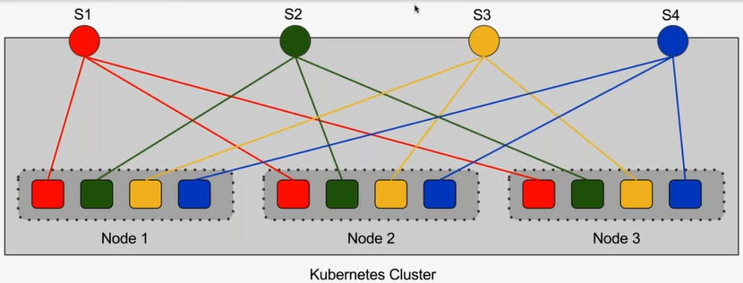
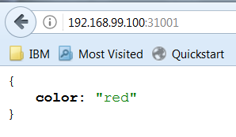
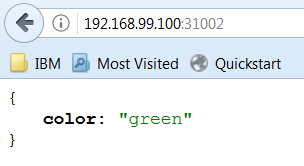
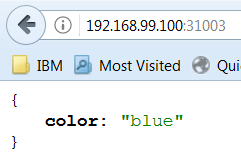
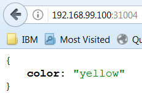
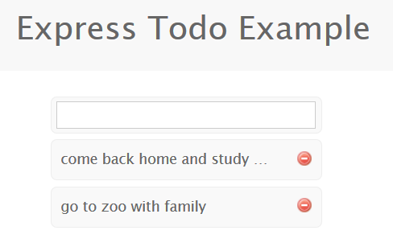

# Understanding Service Discovery in Kubernetes

## Objectives
* What is a Kubernetes Service
* Service Discovery through Environment Variables
* Service Discovery through DNS
* Service Types
	* ClusterIP
	* NodePort
	* LoadBalancer

---
## Quick Recap - Pods and Replication Controllers?
* Pods are fundamental units of deployment
* Each Pod has one or more containers that may expose ports
* Each Pod has a routable IP address assigned to it
* Labels are used to logically identify Pods that match a specific criterion
* Replication Controller's Selector matches the Pods based on Labels
* Replication Controller maintains the desired count of Pods all the time
* Pod IP address may change during its lifetime

## What is a Kubernetes Service?
* A Service is an abstraction of logical set of Pods defined by a policy
* It acts as intermediary for Pods to talks to each other
* Selectors are used for accessing all the Pods that match a specific Label
* Service is an object in Kubernetes - similar to Pods and RCs (replicationcontroller)
* Each Service exposes one of more _ports_ and _targetPorts_
* The _targetPort_ is mapped to the port exposed by matching Pods
* Kuberetes Services support TCP or UDP protocol
## Understanding Services


## Demo
### Creating a Service
No Pods, Services and ReplicationControllers are running, as all were deleted before we started the exercise.

```console
$ kubectl get po
No resources found.
$ ls
Dockerfile  app.js  color-pod.yaml  color-rc.yaml  color-svc.yaml
$ kubectl create -f color-pod.yaml -f color-rc.yaml
pod "red" created
pod "green" created
pod "blue" created
pod "yellow" created
replicationcontroller "red" created
replicationcontroller "green" created
replicationcontroller "blue" created
replicationcontroller "yellow" created
$ kubectl get po
NAME           READY     STATUS              RESTARTS   AGE
blue           0/1       ContainerCreating   0          51s
blue-594mg     0/1       ContainerCreating   0          51s
blue-tzwl6     0/1       ContainerCreating   0          51s
green          0/1       ContainerCreating   0          51s
green-695g9    0/1       ContainerCreating   0          51s
green-9blsq    0/1       ContainerCreating   0          51s
red            0/1       ContainerCreating   0          51s
red-2zr2k      0/1       ContainerCreating   0          51s
red-hsg88      0/1       ContainerCreating   0          51s
yellow         0/1       ContainerCreating   0          51s
yellow-79mr6   0/1       ContainerCreating   0          51s
yellow-vhxjk   0/1       ContainerCreating   0          51s
$ kubectl describe pod red
Name:           red
Namespace:      default
Node:           minikube/192.168.99.100
Start Time:     Mon, 11 Dec 2017 17:09:00 +0800
Labels:         color=red
Annotations:    <none>
Status:         Pending
IP:
Controlled By:  ReplicationController/red
Containers:
  red:
    Container ID:
    Image:          janakiramm/color
    Image ID:
    Port:           8080/TCP
    State:          Waiting
      Reason:       ContainerCreating
    Ready:          False
    Restart Count:  0
    Environment:
      COLOR:  red
    Mounts:
      /var/run/secrets/kubernetes.io/serviceaccount from default-token-zk79b (ro)
Conditions:
  Type           Status
  Initialized    True
  Ready          False
  PodScheduled   True
Volumes:
  default-token-zk79b:
    Type:        Secret (a volume populated by a Secret)
    SecretName:  default-token-zk79b
    Optional:    false
QoS Class:       BestEffort
Node-Selectors:  <none>
Tolerations:     <none>
Events:
  Type    Reason                 Age   From               Message
  ----    ------                 ----  ----               -------
  Normal  Scheduled              2m    default-scheduler  Successfully assigned red to minikube
  Normal  SuccessfulMountVolume  2m    kubelet, minikube  MountVolume.SetUp succeeded for volume "default-token-zk79b"
  Normal  Pulling                2m    kubelet, minikube  pulling image "janakiramm/color"
$ kubectl create -f color-svc.yaml
service "red" created
service "green" created
service "blue" created
service "yellow" created
$ kubectl get svc
NAME         TYPE        CLUSTER-IP       EXTERNAL-IP   PORT(S)        AGE
blue         NodePort    10.102.44.99     <none>        80:31003/TCP   2m
green        NodePort    10.100.116.176   <none>        80:31002/TCP   2m
kubernetes   ClusterIP   10.96.0.1        <none>        443/TCP        8d
red          NodePort    10.104.43.49     <none>        80:31001/TCP   2m
yellow       NodePort    10.105.240.38    <none>        80:31004/TCP   2m
$ kubectl describe svc red
Name:                     red
Namespace:                default
Labels:                   <none>
Annotations:              <none>
Selector:                 color=red
Type:                     NodePort
IP:                       10.104.43.49
Port:                     http  80/TCP
TargetPort:               8080/TCP
NodePort:                 http  31001/TCP
Endpoints:                172.17.0.13:8080,172.17.0.15:8080,172.17.0.3:8080
Session Affinity:         None
External Traffic Policy:  Cluster
Events:                   <none>
$ curl 192.168.99.100:31001
{"color":"red"}
```
This is a tangible proof that the color coded services work...

| | | ||

## Discovering Service - DNS
* The DNS Server watches Kubernetes API for new Services
* The DNS Server creates a set of DNS records for each Service
* Services can be resolved by the name within the same namespace
* Pods in other namespaces can access the Service by adding the namespace to the DNS path
	* _my-service.my-namespace_

## Discovering Services - Env Vars
* Kubernetes creates Docker Link compatible environment variables in all Pods
* Containers can use the environment variable to talk to the service endpoint.
## Service Types
* **ClusterIP**
	* Service is reachable only  from inside of the cluster.
* **NodePort**
	* Service is reachable through <NodeIP>:NodePort address.
* **LoadBalancer**
	* Service is reachable through an external load balancer mapped to <NodeIP>:NodePort address
	
## Demo
### Exposing a Service Internally and Externally
```console
$ kubectl create -f db-pod.yaml -f db-svc.yaml -f web-pod.yaml -f web-rc.yaml -f web-svc.yaml --validate=false
pod "db" created
service "db" created
pod "web" created
replicationcontroller "web" created
service "web" created
$ kubectl get po
NAME        READY     STATUS    RESTARTS   AGE
db          1/1       Running   0          32s
web         1/1       Running   0          32s
web-vk4tx   1/1       Running   0          32s
$ kubectl get svc
NAME         TYPE        CLUSTER-IP      EXTERNAL-IP   PORT(S)        AGE
db           ClusterIP   10.110.111.84   <none>        27017/TCP      1m
kubernetes   ClusterIP   10.96.0.1       <none>        443/TCP        8d
web          NodePort    10.108.13.113   <none>        80:30653/TCP   1m
$ kubectl describe svc web
Name:                     web
Namespace:                default
Labels:                   app=todoapp
                          name=web
Annotations:              <none>
Selector:                 name=web
Type:                     NodePort
IP:                       10.108.13.113
Port:                     http  80/TCP
TargetPort:               3000/TCP
NodePort:                 http  30653/TCP
Endpoints:                172.17.0.3:3000,172.17.0.8:3000
Session Affinity:         None
External Traffic Policy:  Cluster
Events:                   <none>
```

I'll call the service via minikube.
```console
λ minikube service web
There is a newer version of minikube available (v0.24.1).  Download it here:
https://github.com/kubernetes/minikube/releases/tag/v0.24.1

To disable this notification, run the following:
minikube config set WantUpdateNotification false
Opening kubernetes service default/web in default browser...
```


Now, it's time to access the image via `docker exec` command:
```console
$ kubectl exec -it web /bin/sh
# pwd
/usr/src/app
# env
KUBERNETES_SERVICE_PORT=443
KUBERNETES_PORT=tcp://10.96.0.1:443
NODE_VERSION=0.10.40
HOSTNAME=web
DB_SERVICE_PORT=27017
DB_PORT=tcp://10.110.111.84:27017
WEB_SERVICE_PORT=80
WEB_PORT=tcp://10.108.13.113:80
HOME=/root
DB_PORT_27017_TCP_ADDR=10.110.111.84
DB_PORT_27017_TCP_PORT=27017
DB_PORT_27017_TCP_PROTO=tcp
WEB_PORT_80_TCP_ADDR=10.108.13.113
WEB_PORT_80_TCP_PORT=80
WEB_PORT_80_TCP_PROTO=tcp
DB_PORT_27017_TCP=tcp://10.110.111.84:27017
KUBERNETES_PORT_443_TCP_ADDR=10.96.0.1
PATH=/usr/local/sbin:/usr/local/bin:/usr/sbin:/usr/bin:/sbin:/bin
KUBERNETES_PORT_443_TCP_PORT=443
NPM_VERSION=2.14.1
KUBERNETES_PORT_443_TCP_PROTO=tcp
WEB_PORT_80_TCP=tcp://10.108.13.113:80
KUBERNETES_SERVICE_PORT_HTTPS=443
KUBERNETES_PORT_443_TCP=tcp://10.96.0.1:443
WEB_SERVICE_PORT_HTTP=80
KUBERNETES_SERVICE_HOST=10.96.0.1
PWD=/usr/src/app
DB_SERVICE_HOST=10.110.111.84
DB_SERVICE_PORT_DB=27017
WEB_SERVICE_HOST=10.108.13.113
# ping db
PING db.default.svc.cluster.local (10.110.111.84): 56 data bytes
```
## Summary
* What is a Kubernetes Service
* Service Discovery through Environment Variables
* Service Discovery through DNS
* Service Types
	* ClusterIP
	* NodePort
	* LoadBalancer

Reference:
* [Understanding Service Discovery in Kubernetes](https://www.youtube.com/watch?v=NrzrpyMLWes&list=PLF3s2WICJlqOiymMaTLjwwHz-MSVbtJPQ&index=4)
