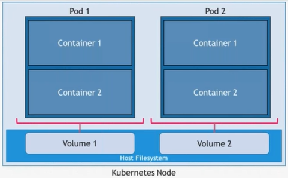
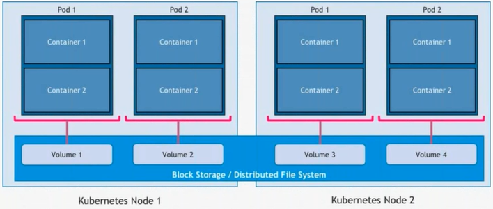
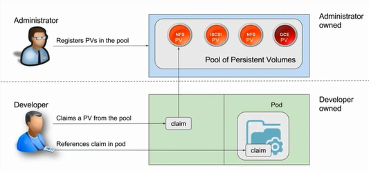

# Dealing with Storage and Persistence

## Objectives
- Adding persistence to Pods
- Dealing with block storage in the cloud
- Understanding Persistence Volumes and Claims
- Demos
---
## Persistence in the Pods
- Pods are ephemeral and stateless
- Volumes bring persistence to Pods
- Kubernetes volumes are similar to Docker volumes, but managed differently
- All containers in a Pod can access the volume
- Volumes are associated with the lifecycle of Pod
- Directories in the host are exposed as volumes
- Volumes may be based on a variety of storage backends
## Pods and Volumes




With storage back-end
## Kubernetes Volumes Types
- **Host-based**
	- EmptyDir
	- HostPath
- **Block Storage**
	- Amazon EBS
	- GCE Persistent Disk
	- Azure Disk
	- vSphere Volume
	- ...
- **Distributed File System**
	- NFS 
	- Ceph
	- Gluster
	- Amazon EFS
	- Azure File System
	- ...
- **Other**
	- Flocker
	- iScsi
	- Git Repo
	- Quobyte
	- ...
## Demo
### Host-based Volumes Block Storage-based Volumes
```console
$ kubectl create -f pod-vol-local.yaml
pod "nginx" created
$ kubectl get po
NAME      READY     STATUS    RESTARTS   AGE
nginx     1/1       Running   0          2m
```
Let's have a look at the newly created nginx pod created
```console
λ kubectl describe po nginx
Name:         nginx
Namespace:    default
Node:         minikube/192.168.99.100
Start Time:   Tue, 12 Dec 2017 14:57:23 +0800
Labels:       env=dev
Annotations:  <none>
Status:       Running
IP:           172.17.0.4
Containers:
  nginx:
    Container ID:   docker://8b2bf6e1a049d92da7ea1dd8769ca230c8b386b9bd0d5517f72a9809ac720b93
    Image:          nginx
    Image ID:       docker-pullable://nginx@sha256:d2b543f6f358a592c42f2085ae69fba138fd1a9da2c15806611145b22bcfd7ab
    Port:           80/TCP
    State:          Running
      Started:      Tue, 12 Dec 2017 14:57:42 +0800
    Ready:          True
    Restart Count:  0
    Environment:    <none>
    Mounts:
      /usr/share/nginx/html from my-vol (rw)
      /var/run/secrets/kubernetes.io/serviceaccount from default-token-zk79b (ro)
Conditions:
  Type           Status
  Initialized    True
  Ready          True
  PodScheduled   True
Volumes:
  my-vol:
    Type:  HostPath (bare host directory volume)
    Path:  /var/lib/my-data
  default-token-zk79b:
    Type:        Secret (a volume populated by a Secret)
    SecretName:  default-token-zk79b
    Optional:    false
QoS Class:       BestEffort
Node-Selectors:  <none>
Tolerations:     <none>
Events:
  Type    Reason                 Age   From               Message
  ----    ------                 ----  ----               -------
  Normal  Scheduled              3m    default-scheduler  Successfully assigned nginx to minikube

  Normal  SuccessfulMountVolume  3m    kubelet, minikube  MountVolume.SetUp succeeded for volume "my-vol"
  Normal  SuccessfulMountVolume  3m    kubelet, minikube  MountVolume.SetUp succeeded for volume "default-token-zk79b"
  Normal  Pulling                3m    kubelet, minikube  pulling image "nginx"
  Normal  Pulled                 2m    kubelet, minikube  Successfully pulled image "nginx"
  Normal  Created                2m    kubelet, minikube  Created container
  Normal  Started                2m    kubelet, minikube  Started container
```
Now, that we know that the nginx pod was created, let's see if the directory in question is accessible.
```console
$ minikube ssh
                         _             _
            _         _ ( )           ( )
  ___ ___  (_)  ___  (_)| |/')  _   _ | |_      __
/' _ ` _ `\| |/' _ `\| || , <  ( ) ( )| '_`\  /'__`\
| ( ) ( ) || || ( ) || || |\`\ | (_) || |_) )(  ___/
(_) (_) (_)(_)(_) (_)(_)(_) (_)`\___/'(_,__/'`\____)

$ sudo -i #act as root user
$ ls -al /var/lib/my-data
total 0
drwxr-xr-x  2 root root 0 Dec 12 06:57 .
drwxr-xr-x 16 root root 0 Dec 12 06:57 ..
```

We are going to create a html file from /var/lib/my-data

```console
$ echo "<h1>Hello from host</h1>" > /var/lib/my-data/index.html
$ cat /var/lib/my-data/index.html
$ <h1>Hello from host</h1>
```

We will test to see if the file is persistent and while we delete the pod!

```console
$ kubectl delete -f pod-vol-local.yaml
pod "nginx" deleted
```

I'm back on the minikube console, where I'll test to see if the index.html file still exists on /var/lib/my-data/.

```console
$ ls -al /var/lib/my-data
total 4
drwxr-xr-x  2 root root  0 Dec 12 07:18 .
drwxr-xr-x 16 root root  0 Dec 12 06:57 ..
-rw-r--r--  1 root root 12 Dec 12 07:18 index.html
$ cat /var/lib/my-data/index.html
<h1>Hello from host</h1>
```

Recreate the pod and service

```console
kubectl create -f pod-vol-local.yaml
```

See the result

```console
minikube service nginx
$ Opening kubernetes service default/nginx in default browser...
```

Remove pod and service

```console
kubectl delete -f pod-vol-local.yaml
```

## Understanding Persistent Volumes & Claims

- PersistentVolume(PV)
    - Networked storage in the cluster pre-provisioned by an administrator
- PersistentVolumeClaim (PVC)
    - Storageresource requested by a user
- StorageClass
      - Types of supported storage profiles offered by administrators

## Storage Provisioning Workflow



Lifecycle of a Presistent Volume

- Provisioning
- Binding
- Using
- Releasing
- Reclaiming
  
## Demo

### Provisioning and Claiming NFS-based Volumes

```console
$ kubectl create -f my-pv.yaml
persistentvolume "my-pv" created
$ kubectl get pv
NAME      CAPACITY   ACCESS MODES   RECLAIM POLICY   STATUS      CLAIM     STORAGECLASS   REASON
   AGE
my-pv     1Gi        RWO            Recycle          Available
   5m
```

Let's have a different view of the Persistent Volume

```console
$ kubectl describe pv
Name:            my-pv
Labels:          type=local
Annotations:     <none>
Finalizers:      [kubernetes.io/pv-protection]
StorageClass:    manual
Status:          Available
Claim:
Reclaim Policy:  Retain
Access Modes:    RWX
VolumeMode:      Filesystem
Capacity:        1Gi
Node Affinity:   <none>
Message:
Source:
    Type:          HostPath (bare host directory volume)
    Path:          /mypv
    HostPathType:
Events:            <none>
```

Let's create the `PersistentVolumeClaim`

```console
$ kubectl create -f my-pvc.yaml
persistentvolumeclaim "my-pvc" created
```

View the PersistentVolumeClaim

```console
$ kubectl get pvc
NAME     STATUS   VOLUME   CAPACITY   ACCESS MODES   STORAGECLASS   AGE
my-pvc   Bound    my-pv    1Gi        RWX            manual         8m56s
```

Note that the status of pvc is `Bound` and the volume is `my-pv`

Describe the `PersistentVolumeClaim`

```console
$ kubectl describe pvc
Name:          my-pvc
Namespace:     default
StorageClass:  manual
Status:        Bound
Volume:        my-pv
Labels:        <none>
Annotations:   pv.kubernetes.io/bind-completed: yes
               pv.kubernetes.io/bound-by-controller: yes
Finalizers:    [kubernetes.io/pvc-protection]
Capacity:      1Gi
Access Modes:  RWX
VolumeMode:    Filesystem
Events:        <none>
Mounted By:    <none>
```

The `PersistentVolume` and `PersistentVolumeClaim` are created, it's time to create the Pod with that.

```console
$ kubectl create -f my-pod.yaml
pod "my-pod" created
$ kubectl get pod
NAME      READY     STATUS    RESTARTS   AGE
my-pod    1/1       Running   0          1m
```

Let's have a closer look at the Pod by looking at the describe value...

```console
$ kubectl describe po
Name:               my-pod
Namespace:          default
Priority:           0
PriorityClassName:  <none>
Node:               minikube/10.0.2.15
Start Time:         Tue, 21 May 2019 10:42:59 +0800
Labels:             env=web
Annotations:        <none>
Status:             Running
IP:                 172.17.0.6
Containers:
  web:
    Container ID:   docker://e04f73277cadb6181b2d4665b7c95f2abe9dfce90c5c324f182f1b8050d87449
    Image:          nginx:1.7.9
    Image ID:       docker-pullable://nginx@sha256:e3456c851a152494c3e4ff5fcc26f240206abac0c9d794affb40e0714846c451
    Port:           80/TCP
    Host Port:      0/TCP
    State:          Running
      Started:      Tue, 21 May 2019 10:43:00 +0800
    Ready:          True
    Restart Count:  0
    Environment:    <none>
    Mounts:
      /usr/share/nginx/html from mypd (rw)
      /var/run/secrets/kubernetes.io/serviceaccount from default-token-98ltk (ro)
Conditions:
  Type              Status
  Initialized       True
  Ready             True
  ContainersReady   True
  PodScheduled      True
Volumes:
  mypd:
    Type:       PersistentVolumeClaim (a reference to a PersistentVolumeClaim in the same namespace)
    ClaimName:  my-pvc
    ReadOnly:   false
  default-token-98ltk:
    Type:        Secret (a volume populated by a Secret)
    SecretName:  default-token-98ltk
    Optional:    false
QoS Class:       BestEffort
Node-Selectors:  <none>
Tolerations:     node.kubernetes.io/not-ready:NoExecute for 300s
                 node.kubernetes.io/unreachable:NoExecute for 300s
Events:
  Type    Reason     Age   From               Message
  ----    ------     ----  ----               -------
  Normal  Scheduled  2s    default-scheduler  Successfully assigned default/my-pod to minikube
  Normal  Pulled     1s    kubelet, minikube  Container image "nginx:1.7.9" already present on machine
  Normal  Created    1s    kubelet, minikube  Created container web
  Normal  Started    1s    kubelet, minikube  Started container web
```

Visit `192.168.99.100:30100` and you should see `Forbidden` errors. Let's create a simple `html` page:

```console
minikube ssh
$                          _             _
$             _         _ ( )           ( )
$   ___ ___  (_)  ___  (_)| |/')  _   _ | |_      __
$ /' _ ` _ `\| |/' _ `\| || , <  ( ) ( )| '_`\  /'__`\
$ | ( ) ( ) || || ( ) || || |\`\ | (_) || |_) )(  ___/
$ (_) (_) (_)(_)(_) (_)(_)(_) (_)`\___/'(_,__/'`\____)

sudo -i
echo "<h1>Hello from host</h1>" > /mypv/index.html
exit
$ logout
exit
```

Visit `192.168.99.100:30100` again and you should see `Hello from host`

Now, clear the environment

```console
kubectl delete -f my-pod.yaml -f my-pv.yaml -f my-pvc.yaml
```

## Summary

- Adding persistence to Pods
- Dealing with block storage in the cloud
- Understanding Persistence Volumes and Claims
- Demos

Reference:
- [Kubernetes Webinar Series - Dealing with Storage and Persistence](https://www.youtube.com/watch?v=n06kKYS6LZE&index=6&list=PLF3s2WICJlqOiymMaTLjwwHz-MSVbtJPQ)

