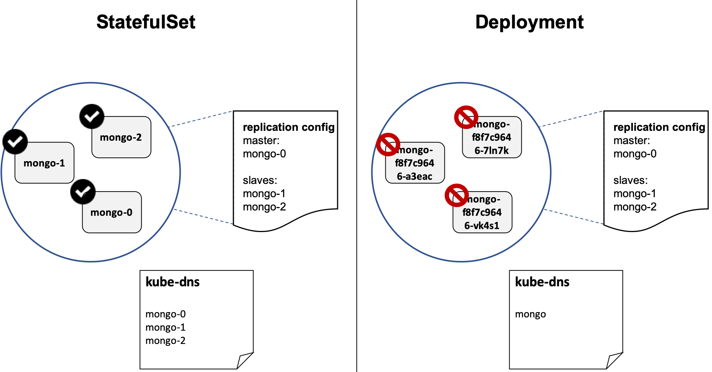

# Deploying Stateful Application with StatefulSet

## Overview

### Persistence and Containers

* Containers are designed to be stateless
* Containers use ephemeral storage
* Pods can be made stateful through volumes
* Running databases could be challenging
  * Lack of stable naming convention
  * Lack of stable persistent storage per Pod

### Introducing StatefulSets

* Bringing the concept of ReplicaSets to stateful Pods
* Enables running Pods in a "clusteres mode"
* Ideal for deploying highly available database workloads
  
StatefulSets are valuable for applications that require one or more of the following:

* Stable, unique network identifiers.
* Stable, persistent storage.
* Ordered, graceful deployment and scaling.
* Ordered, automated rolling updates.

In the above, stable is synonymous with persistence across Pod (re)scheduling. If an application doesn’t require any stable identifiers or ordered deployment, deletion, or scaling, you should deploy your application with a controller that provides a set of stateless replicas. Controllers such as Deployment or ReplicaSet may be better suited to your stateless needs.

Consider a MongoDB cluster. Each MongoDB pod needs to be named deterministically as each pod needs to be aware of other pod's hostname to send keep-alive messages and perform replication.

`Deployment` with 3 replicas will create 3 pods with random prefix and is exposed as 1 `Service`. The DNS server will only have 1 entry and thus the pods will not be able to communicate with each other. The pods will share storage. Thus `Deployment` is suitable for stateless application.

`StatefulSet` with 3 replicas will create 3 pods with ordered (and hence deterministic) prefix. The DSN server will also have 3 corresponding entries and thus the pods will be able to communicate with each other. The pods will have its own separate storage.



## Demo

Create a `Role Binding` to allow `mongodb-sidecar` container to view the MongoDB pods in order to configure replication. RBAC will be covered in a separate topic, so we don't have to discuss in detail now.

```console
$ kubectl create -f mongo-role.yaml
clusterrolebinding.rbac.authorization.k8s.io/default-view created
```

Create a "helper" pod to perform `nslookup` for demonstrations in later steps. Note that this pod has no impact on the overall deployment

```console
$ kubectl create -f helper.yaml
pod/helper created
```

Deploy a headless service. The StatefulSet feature is used with a dedicated “service” that points to each of its member pods. This service should be “headless,” meaning that it doesn’t create ClusterIP for load balancing, but is used for static DNS naming of pods that will be launched. This service name will be referenced in “spec: serviceName: ” section of the StatefulSet configuration file. It will cause the creation of enumerated DNS records in this format: mongo-0,” mongo-1,” mongo-2” etc. We will see this in effect in the later steps.

```console
kubectl create -f mongo-headless.yaml
service/mongo created
```

Observe storageclass `standard`. When provisioned, a PV with type `HostPath` will be created and a PVC will be automatically bound to said PV. This is specified in the `statefulset` yaml [file](./mongo-statefulset.yaml)

```console
$ kubectl get storageclass standard
NAME                 PROVISIONER                AGE
standard (default)   k8s.io/minikube-hostpath   45h
```

Create MongoDB `statefulset`

```console
$ kubectl create -f mongo-statefulset.yaml
statefulset.apps/mongo created
```

As we can see below, the pod name is ordered i.e. `mongo-1`, `mongo-2`, etc. Compare this to `Deployments`, whereby the pod name is non-deterministic i.e. there is always a random string prefix e.g. `mongo-a4s2`

```console
$ kubectl get pods
NAME      READY   STATUS    RESTARTS   AGE
helper    1/1     Running   0          43s
mongo-0   2/2     Running   0          16s
mongo-1   2/2     Running   0          11s
mongo-2   2/2     Running   0          6s
```

PVC is automatically created for each pod

```console
$ kubectl get pvc
NAME                               STATUS   VOLUME                                     CAPACITY   ACCESS MODES   STORAGECLASS   AGE
mongo-persistent-storage-mongo-0   Bound    pvc-aa331c71-7d1a-11e9-a88e-080027cf8df0   2Gi        RWO            standard       66s
mongo-persistent-storage-mongo-1   Bound    pvc-adc435fd-7d1a-11e9-a88e-080027cf8df0   2Gi        RWO            standard       60s
mongo-persistent-storage-mongo-2   Bound    pvc-b177d0fb-7d1a-11e9-a88e-080027cf8df0   2Gi        RWO            standard       53s
```

Each PVC is bound to PV

```console
$ kubectl get pv
NAME                                       CAPACITY   ACCESS MODES   RECLAIM POLICY   STATUS   CLAIM                                      STORAGECLASS   REASON   AGE
pvc-aa331c71-7d1a-11e9-a88e-080027cf8df0   2Gi        RWO            Delete           Bound    default/mongo-persistent-storage-mongo-0   standard                22s
pvc-adc435fd-7d1a-11e9-a88e-080027cf8df0   2Gi        RWO            Delete           Bound    default/mongo-persistent-storage-mongo-1   standard                17s
pvc-b177d0fb-7d1a-11e9-a88e-080027cf8df0   2Gi        RWO            Delete           Bound    default/mongo-persistent-storage-mongo-2   standard                10s
```

Try to perform `nslookup` on `mongo`, which is the headless service name. The DNS entries for the pods are automatically added:

```console
$ kubectl exec helper nslookup mongo
Server:    10.96.0.10
Address 1: 10.96.0.10 kube-dns.kube-system.svc.cluster.local

Name:      mongo
Address 1: 172.17.0.7 mongo-1.mongo.default.svc.cluster.local
Address 2: 172.17.0.6 mongo-0.mongo.default.svc.cluster.local
Address 3: 172.17.0.8 mongo-2.mongo.default.svc.cluster.local
```

View the replication configuration. The configuration is performed automatically by `mongo-sidecar` container, which detects all the MongoDB pods in the namespace.

```console
$ kubectl exec -it mongo-0 mongo
Welcome to the MongoDB shell.
rs0:PRIMARY>
$ rs.conf()
{
    "_id" : "rs0",
    "version" : 5,
    "protocolVersion" : NumberLong(1),
    "members" : [
        {
            "_id" : 0,
            "host" : "mongo-0.mongo.default.svc.cluster.local:27017",
            "arbiterOnly" : false,
            "buildIndexes" : true,
            "hidden" : false,
            "priority" : 1,
            "tags" : {

            },
            "slaveDelay" : NumberLong(0),
            "votes" : 1
        },
        {
            "_id" : 1,
            "host" : "mongo-1.mongo.default.svc.cluster.local:27017",
            "arbiterOnly" : false,
            "buildIndexes" : true,
            "hidden" : false,
            "priority" : 1,
            "tags" : {

            },
            "slaveDelay" : NumberLong(0),
            "votes" : 1
        },
        {
            "_id" : 2,
            "host" : "mongo-2.mongo.default.svc.cluster.local:27017",
            "arbiterOnly" : false,
            "buildIndexes" : true,
            "hidden" : false,
            "priority" : 1,
            "tags" : {

            },
            "slaveDelay" : NumberLong(0),
            "votes" : 1
        }
    ],
    "settings" : {
        "chainingAllowed" : true,
        "heartbeatIntervalMillis" : 2000,
        "heartbeatTimeoutSecs" : 10,
        "electionTimeoutMillis" : 10000,
        "catchUpTimeoutMillis" : 60000,
        "getLastErrorModes" : {

        },
        "getLastErrorDefaults" : {
            "w" : 1,
            "wtimeout" : 0
        },
        "replicaSetId" : ObjectId("5ce61664ff641f44004e9eb1")
    }
}
$ exit
bye
```

Scale up to 4

```console
$ kubectl scale --replicas=4 statefulset mongo
statefulset.apps/mongo scaled
```

As expected, the number of pods increase to 4

```console
$ kubectl get pods
helper    1/1     Running   0          6m16s
mongo-0   2/2     Running   0          5m49s
mongo-1   2/2     Running   0          5m44s
mongo-2   2/2     Running   0          5m39s
mongo-3   2/2     Running   0          38s
```

DNS entry for the new MongoDB pod is also added automatically

```console
$ kubectl exec helper nslookup mongo
Server:    10.96.0.10
Address 1: 10.96.0.10 kube-dns.kube-system.svc.cluster.local

Name:      mongo
Address 1: 172.17.0.6 mongo-0.mongo.default.svc.cluster.local
Address 2: 172.17.0.8 mongo-2.mongo.default.svc.cluster.local
Address 3: 172.17.0.7 mongo-1.mongo.default.svc.cluster.local
Address 4: 172.17.0.9 mongo-3.mongo.default.svc.cluster.local
```

Recheck the replication configuration and observe a new host, `mongo-3.mongo.default.svc.cluster.local:27017`

```console
$ kubectl exec -it mongo-0 mongo
Welcome to the MongoDB shell.
rs0:PRIMARY>
$ rs.conf() # observe that there is a new host
$ exit
bye
```

Now let's see what happens when `mongo-2` is deleted.

```console
kubectl delete pod mongo-2
pod "mongo-2" deleted
```

A new pod with the same name will be created.

```console
kubectl get pod
NAME      READY   STATUS              RESTARTS   AGE
helper    1/1     Running             0          8m16s
mongo-0   2/2     Running             0          7m49s
mongo-1   2/2     Running             0          7m44s
mongo-2   0/2     ContainerCreating   0          1s
mongo-3   2/2     Running             0          2m38s
```

Clear up `statefulset` and its dependencies

```console
$ kubectl delete -f helper.yaml -f mongo-headless.yaml -f mongo-role.yaml -f mongo-statefulset.yaml
pod "helper" deleted
service "mongo" deleted
clusterrolebinding.rbac.authorization.k8s.io "default-view" deleted
statefulset.apps "mongo" deleted
```

Delete `pvc` and `pv`

```console
$ kubectl delete pvc --all
persistentvolumeclaim "mongo-persistent-storage-mongo-0" deleted
persistentvolumeclaim "mongo-persistent-storage-mongo-1" deleted
persistentvolumeclaim "mongo-persistent-storage-mongo-2" deleted
persistentvolumeclaim "mongo-persistent-storage-mongo-3" deleted
$ kubectl get pv
No resources found.
```