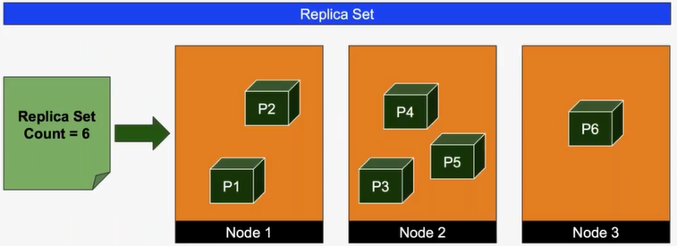
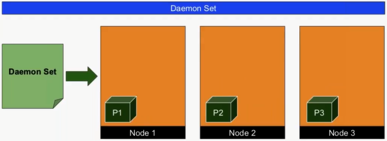
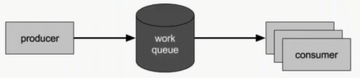

# Exploring Daemon Sets and Jobs
## Objectives
- Recap of Kubernetes Controllers
- What are Daemon Sets?
- Daemon Set vs Replica Sets
- Use Cases for Daemon Sets
- Configurating Run to Completion Jobs
- Scheduling Jobs with Cron

---
## Kubernetes Controllers
- Replica Sets
- Deployments
- Stateful Sets
- Daemon Sets
- Jobs (One time)
- Cron Jobs
## Overview of Daemon Set
- Daemon Set runs a copy of a pod on every node in a Kubernetes cluster
- Daemon Set and Replica Set are similar but have different use cases
- New nodes automatically gets a Daemon Set pod
- When a node is removed, the Daemon Set pod will not be rescheduled

**The number of pods in the Daemon Set == The number of nodes in cluster**
##Daemon Set vs Replica Set

**Replica Set**

**Daemon Set**
## Daemon Set Use Cases
- Logging Aggregators
- Monitoring
- Load Balancers / Reverse Proxies / API Gateways
- Generic background job that needs to be run on each node
## Demo
### Exploring Daemon Set
Let's build the replicaset
```console
$ cd DaemonSet
$ kubectl create -f nginx-rs.yaml
replicaset "nginx" created
``` 
Let's see how many pods are running, we specified 3 on the replicaset; thus, 3 should be the number of pods.
```console
λ kubectl get pods -o wide
NAME          READY     STATUS    RESTARTS   AGE       IP           NODE
nginx-hcnck   1/1       Running   0          14s       172.17.0.9   minikube
nginx-lbbh5   1/1       Running   0          14s       172.17.0.8   minikube
nginx-sml9m   1/1       Running   0          14s       172.17.0.7   minikube
```
Because I'm running everything from minikube it's not possible to put to text the Daemon set, but for now we can see that all the pods are running on minikube, as I only have one node, for replicaset that works fine.

I'm going to scale this to 10 replicas.
```console
$ kubectl scale --replicas=10 rs/nginx
replicaset "nginx" scaled
$ kubectl get pods -o wide
NAME          READY     STATUS    RESTARTS   AGE       IP            NODE
nginx-6gcqt   1/1       Running   0          24s       172.17.0.14   minikube
nginx-8wv8j   1/1       Running   0          24s       172.17.0.11   minikube
nginx-g65pk   1/1       Running   0          24s       172.17.0.16   minikube
nginx-hcnck   1/1       Running   0          2m        172.17.0.9    minikube
nginx-l4ggn   1/1       Running   0          24s       172.17.0.12   minikube
nginx-lbbh5   1/1       Running   0          2m        172.17.0.8    minikube
nginx-qkjjq   1/1       Running   0          24s       172.17.0.13   minikube
nginx-sml9m   1/1       Running   0          2m        172.17.0.7    minikube
nginx-wjdvv   1/1       Running   0          24s       172.17.0.15   minikube
nginx-x764k   1/1       Running   0          24s       172.17.0.10   minikube
```
I think we undestand replicaset, let's delete all to start playing with daemonsets
```console
$ kubectl delete rs/nginx
replicaset "nginx" deleted
$ kubectl get po -o wide
No resources found.
```
Ok, now we start working on the daemonset; as stated earlier, because I only have one node this exercise will not show much as how the daemonset set works, it will only spawn one pod.

```console
$ kubectl create -f nginx-ds.yaml
daemonset "nginx" created
$ kubectl get pods -o wide
NAME          READY     STATUS    RESTARTS   AGE       IP           NODE
nginx-6ctfr   1/1       Running   0          39m       172.17.0.7   minikube
$ kubectl scale --replicas=10 ds/nginx
Error from server (NotFound): the server could not find the requested resource
$ kubectl delete ds nginx
daemonset "nginx" deleted
```
<!-- resume at 30' Jobe in Kubernetes -->
## Jobs in Kubernetes
- There are two types of job controllers in Kubernetes
	- One time / Run on completion
	- Scheduled Jobs
- Both are extremly useful in performing batch operations
- Jobs complement other controllers like Replica Set and Daemon Set
## Run to Completion Jobs
- Each Job creates one or more pods and ensures that they are successfully terminated
- If a pod or node fails during the execution, job controller will restart or reschedules the pod
- Job can also be used to run multiple pods in parallel
- A job can be scaled up using the _kubectl scale_ command
- Job's spec may define the parallelism value for running multiple pods in parallel
## Use case for Jobs
- One time, initialization of resources
	- Databases
	- File Systems
	- Cache
	- Configuration
- Multiple workers to process messages in a queue

## Demo
### Using Run to Complete Jobs
```console
$ cd Jobs/OneTime
$ kubectl create -f mysql.yaml
pod/mysql created
service/mysql created
$ kubectl get po
NAME      READY     STATUS    RESTARTS   AGE
mysql     1/1       Running   0          3m
$ kubectl get svc
NAME             TYPE        CLUSTER-IP       EXTERNAL-IP   PORT(S)          AGE
kubernetes   ClusterIP   10.96.0.1     <none>        443/TCP          17h
mysql        NodePort    10.96.56.40   <none>        3306:30306/TCP   24s
```

Now, it's time to test the mysql connection

```console
$ kubectl exec mysql -- mysql -u root -ppassword -e 'show databases'
mysql: [Warning] Using a password on the command line interface can be insecure.
Database
information_schema
mysql
performance_schema
sys
```

```console
$ kubectl create -f db-init-job.yaml
job "db-init" created
$ kubectl get po -a
NAME            READY     STATUS      RESTARTS   AGE
db-init-b8mpr   0/1       Completed   0          3m
mysql           1/1       Running     0          5h
$ kubectl logs db-init-b8mpr
mysql: [Warning] Using a password on the command line interface can be insecure.
$ kubectl exec mysql -- mysql -u root -ppassword -e 'show databases'
mysql: [Warning] Using a password on the command line interface can be insecure.
Database
information_schema
cloudshop
mysql
performance_schema
sys
$ kubectl describe job db-init
Name:           db-init
Namespace:      default
Selector:       controller-uid=a238d063-e0b0-11e7-a8a8-08002720cfab
Labels:         app=myapp
                tier=data
Annotations:    <none>
Parallelism:    1
Completions:    1
Start Time:     Thu, 14 Dec 2017 17:24:49 +0800
Pods Statuses:  0 Running / 1 Succeeded / 0 Failed
Pod Template:
  Labels:  controller-uid=a238d063-e0b0-11e7-a8a8-08002720cfab
           job-name=db-init
  Containers:
   db-init:
    Image:  janakiramm/db-init
    Port:   <none>
    Environment:
      USERNAME:  root
      PASSWORD:  password
      HOST:      mysql
      PORT:      3306
    Mounts:      <none>
  Volumes:       <none>
Events:
  Type    Reason            Age   From            Message
  ----    ------            ----  ----            -------
  Normal  SuccessfulCreate  7m    job-controller  Created pod: db-init-b8mpr
```

Clear environment

```console
kubectl delete -f mysql.yaml -f db-init-job.yaml
```

## Configuring Cron Jobs

- A Cron Job manages time based Jobs
	- Once at a specified point in time
	- Repeatedly at a specified point in time
- Each Cron Job is similar to one line of a crontab (cron table) file
- A typical use cases include
	- Schedule a job execution at a given point in time
	- Create a periodic job 
		- Database backup
		- Sending emails
		##### Works only clusters with _--runtime-config=batch/v2alpha1=true_

## Demo
### Using Cron Jobs
```console
$ cd Jobs/Cron
$ kubectl create -f cron.yaml
cronjob.batch/hello created
$ kubectl get cronjob hello
NAME    SCHEDULE      SUSPEND   ACTIVE   LAST SCHEDULE   AGE
hello   */1 * * * *   False     0        10s             93s
$ kubectl get job --watch
NAME               COMPLETIONS   DURATION   AGE
hello-1558490820   1/1           7s         104s
hello-1558490880   1/1           6s         44s
$ pod=$(kubectl get pods --selector=job-name=hello-1558490820 --output=jsonpath={.items[].metadata.name})
$ kubectl logs $pod
Wed May 22 02:07:06 UTC 2019
Hello from Kubernetes cluster
```

Clean up

```console
λ kubectl delete cronjob hello
cronjob "hello" deleted
```

Reference:
- [Kubernetes Webinar Series - Exploring Daemon Sets and Jobs](https://www.youtube.com/watch?v=qYvXwWT-13w&index=10&list=PLF3s2WICJlqOiymMaTLjwwHz-MSVbtJPQ)